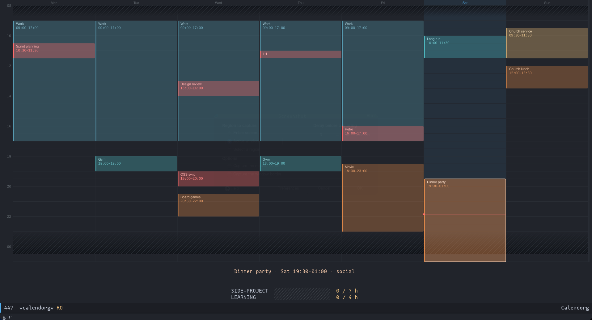

* Calendorg
Highly opinionated weekly schedule viewer for Doom Emacs.
- Input: Org file (satisfying a lightweight schema)
- Output: rendered SVG calendar

*Features:*
1. Allocate timeblocks into your schedule.
2. See if you meet your weekly hour targets for any hourly commitments.
3. Beautiful SVG rendering.

*Operation:*
1. Keyboard driven (Vim bindings), dark mode, one window.
** Install
Needs Emacs 29+ built with =RSVG=, and optionally evil-mode.
#+begin_src emacs-lisp
;; packages.el
(package! calendorg :recipe (:local-repo "/home/lh/nextcloud-sync/projects/calendorg" :files ("*.el")))

;; config.el
(use-package! calendorg
  :commands calendorg
  :init (map! :map doom-leader-open-map "c" #'calendorg))
#+end_src

Both files live in =calendorg-schedule-dir=, which defaults to the =SCHEDULE_DIR= environment variable, or =~/nextcloud-sync/todo/=. Write =schedule.org= there following [[file:schedule-format.org][schedule-format.org]]. Then =calendorg-blocks.org= is created on first allocation.
** Usage
=SPC o c= opens the calendar.

| Keybind      | Action                    |
|--------------+---------------------------|
| =j=, =k=         | next, previous block      |
| =h=, =l=         | nearest block left, right |
| =TAB=, =S-TAB=   | same as =j=, =k=              |
| =gg=, =G=        | first, last block of week |
| =0=, =$=         | first, last block of day  |
| =V=            | place a time cursor       |
| =v=            | select a time range       |
| =i=            | edit selected             |
| =x=            | delete selected           |
| =c=            | comment on selected       |
| =gr=           | reload from disk          |
| =q=            | quit                      |

*Visual Selection Mode*
=V= puts a line cursor on a 15 minute boundary; =j= and =k= move it, =v= starts selecting a range from there. =v= on its own selects from the block's end.

| Visual-Select Keybind | Action           |
|-----------------------+------------------|
| =j=, =k=                  | grow, shrink     |
| =J=, =K=                  | move the range   |
| =h=, =l=                  | shift day, wraps |
| =o=                     | swap ends        |
| =RET=                   | allocate         |
| =t=                     | add other event  |
| =ESC=                   | cancel           |

To open an Emacs daemon client window with Calendorg loaded:
#+begin_src bash
emacsclient -c -n -F '((name . "calendorg"))' -e '(calendorg)'
#+end_src
** Configuration
*Note:* All of these are =defcustom=, so =M-x customize-group RET calendorg= works too.
*** Files
| Variable                | Default                                    | Meaning                                     |
|-------------------------+--------------------------------------------+---------------------------------------------|
| =calendorg-schedule-dir=  | =$SCHEDULE_DIR=, else =~/nextcloud-sync/todo/= | Where schedule and timeblock files live     |
| =calendorg-schedule-file= | =schedule.org=                               | Your schedule, never modified by Calendorg. |
| =calendorg-blocks-file=   | =calendorg-blocks.org=                       | Your Calendorg timeblock data.              |

*Note:* filenames are assumed relative to =calendorg-schedule-dir= unless they are absolute.
*** Appearance
| Variable                   | Default   | Meaning                    |
|----------------------------+-----------+----------------------------|
| =calendorg-bg=               | =#21242b=   | Canvas background          |
| =calendorg-grid-color=       | =#2a2e35=   | Hour and day rules         |
| =calendorg-grid-color-faint= | =#23262d=   | Half-hour rules            |
| =calendorg-muted=            | =#5B6268=   | Axis labels                |
| =calendorg-today-color=      | =#51afef=   | Today's column and header  |
| =calendorg-now-color=        | =#ff6c6b=   | Current-time rule and dot  |
| =calendorg-select-color=     | =#c678dd=   | Time cursor and selection  |
| =calendorg-sleep-color=      | =#31363f=   | Sleep hatching             |
| =calendorg-hour-height=      | =24=        | Fallback pixels per hour   |

*Notes:*
1. Colors are =#RRGGBB= strings. Block colors are not configured here, rather they are per-type in =schedule.org=.
2. Immutable parameters, as =defconst=: the grid runs 08:00 to 01:00 (=calendorg-grid-start=, =calendorg-grid-end=) and the smallest unit is 15 minutes (=calendorg-slot=).
3. Nothing outside the grid renders, so a wake time before 08:00 is not drawn.
